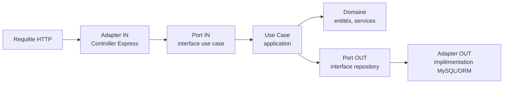
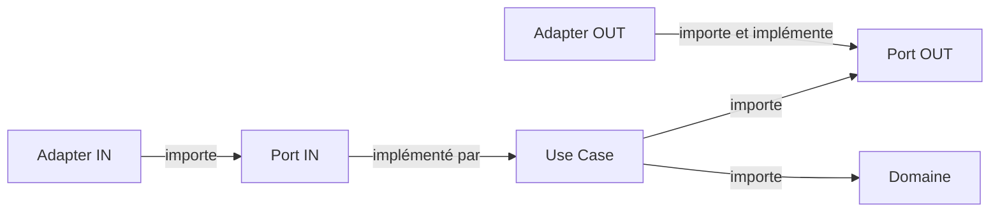

# Architecture backend — motogp-hexagonal

## Objectif de ce document

Ce document pose la structure du backend **avant l'écriture du moindre code métier**.
C'est volontaire : dans une démarche d'étude d'architecture hexagonale, la structure
n'est pas un détail d'implémentation qu'on découvre en avançant, c'est une décision
de conception qui doit être justifiée, comprise, et pouvoir être remise en question
par écrit.

Ce fichier est vivant. Il évolue avec le projet — voir le
[Journal d'évolution](#journal-dévolution) en bas de page. Chaque changement de
structure significatif doit s'accompagner d'une entrée ici et, si la décision est
structurante, d'un ADR dédié dans `docs/adr/`.

## Principe fondamental : la règle de dépendance

L'architecture hexagonale (aussi appelée *Ports & Adapters*, Alistair Cockburn, 2005)
repose sur une seule règle, dont tout le reste découle :

> Les dépendances de code ne pointent que vers l'intérieur. Le domaine ne connaît
> jamais l'infrastructure. C'est l'infrastructure qui connaît le domaine.

Il est important de distinguer deux flux qui vont dans des sens différents :

**Flux d'exécution** (l'ordre dans lequel le code s'exécute à l'appel d'une requête) :



**Flux de dépendances** (qui importe quoi dans le code — c'est l'inverse du flux
d'exécution sur la partie sortante) :



Le domaine (`domain/`) n'importe **jamais** rien depuis `adapters/` ou
`infrastructure/`. C'est la seule règle non négociable de cette architecture — tout
le découpage en dossiers ci-dessous existe pour la faire respecter mécaniquement,
pas seulement par discipline.

## Structure posée

```
src/
  domain/               # aucune dépendance externe
    entities/           # Pilote, Ecurie, GrandPrix, Classement...
    value-objects/       # Points, PositionArrivee, Chrono...
    services/            # ReglementPointsMotoGP (logique de calcul)
    ports/
      in/                 # ex: CalculerClassementUseCase (interface)
      out/                # ex: PiloteRepositoryPort (interface)
  application/
    use-cases/            # implémentent les ports "in", orchestrent le domaine
  adapters/
    in/http/               # controllers Express, DTO, validation (zod)
    out/persistence/       # implémentation MySQL du PiloteRepositoryPort via ton ORM
  infrastructure/          # configuration DI, bootstrap serveur
```

### `domain/entities/`

Objets métier porteurs d'une identité (un `Pilote` reste le même pilote même si son
nom change). Aucune dépendance à un framework, un ORM ou une librairie HTTP. Une
entité doit pouvoir être instanciée et testée dans un fichier de test qui n'importe
rien d'autre que l'entité elle-même.

### `domain/value-objects/`

Objets définis uniquement par leur valeur, sans identité propre, généralement
immuables (`Points`, `PositionArrivee`, `Chrono`). C'est ici que vivent les règles
de validation intrinsèques à une valeur (ex : un `Chrono` ne peut pas être négatif).

### `domain/services/`

Logique métier qui ne trouve naturellement sa place dans aucune entité ou value
object précis, typiquement parce qu'elle orchestre plusieurs d'entre eux
(`ReglementPointsMotoGP` qui calcule l'attribution des points à partir d'une liste
de résultats). Reste pur : pas d'accès base de données, pas d'appel HTTP.

### `domain/ports/in/` et `domain/ports/out/`

Les interfaces qui définissent les frontières du domaine :
- **`ports/in/`** : ce que le monde extérieur peut demander au domaine (contrat
  qu'un use case doit respecter, ex : `CalculerClassementUseCase`)
- **`ports/out/`** : ce que le domaine a besoin d'obtenir du monde extérieur
  (contrat qu'un adapter doit implémenter, ex : `PiloteRepositoryPort`)

Ces deux sous-dossiers sont le cœur du pattern. Tout le reste de la structure
n'existe que pour leur donner une implémentation concrète sans jamais les
compromettre.

### `application/use-cases/`

Implémentent les ports `in`, orchestrent les entités et services du domaine, et
font appel aux ports `out` quand une donnée externe est nécessaire. Un use case
ne contient pas de règle métier lui-même — il orchestre. Si une logique de calcul
s'installe durablement dans un use case, c'est un signal qu'elle devrait migrer
vers `domain/services/`.

### `adapters/in/http/`

Controllers Express (ou équivalent), DTO, et validation d'entrée (zod). Traduit
une requête HTTP en appel de use case, et un résultat de use case en réponse HTTP.
Ne contient aucune règle métier — uniquement de la traduction de format.

### `adapters/out/persistence/`

Implémentation concrète des ports `out` de persistance, via l'ORM choisi. C'est le
seul endroit du projet qui a le droit de connaître le client ORM et le schéma de
base de données. Le mapping entre le modèle de données et les entités du domaine
se fait ici.

### `infrastructure/`

Configuration transverse : injection de dépendances (composition root), bootstrap
du serveur, configuration d'environnement. C'est le seul dossier qui a le droit de
connaître **toutes** les couches en même temps.

## Ce qui n'est volontairement pas encore décidé

Documenté ici pour être honnête sur l'état d'avancement de la réflexion, et pour
que ces points reviennent sous forme d'ADR quand ils seront tranchés :

- Choix définitif de l'ORM (Prisma vs TypeORM) — à trancher dans ADR-0002
- Stratégie de gestion des erreurs du domaine (exceptions typées vs `Result<T, E>`)
- Stratégie d'injection de dépendances (composition manuelle vs conteneur DI)
- Authentification/autorisation pour les routes admin (US-RES-01)

## Journal d'évolution

| Date | Version doc | Changement | Story / ADR liée |
|---|---|---|---|
| 2026-08-02 | 0.1 | Structure des dossiers posée. Définition des couches, de la règle de dépendance, et des flux d'exécution vs dépendances. Aucun code écrit à ce stade. | ADR-0001 |
